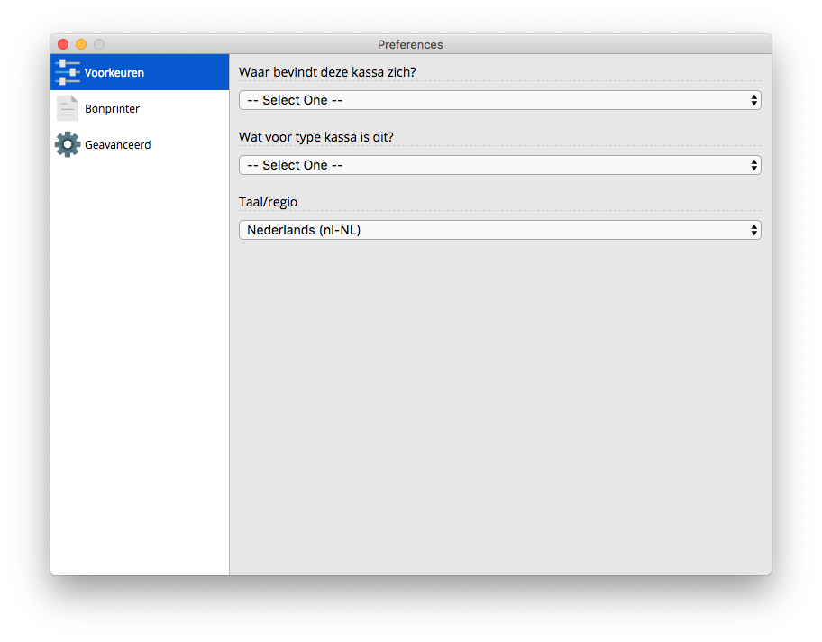
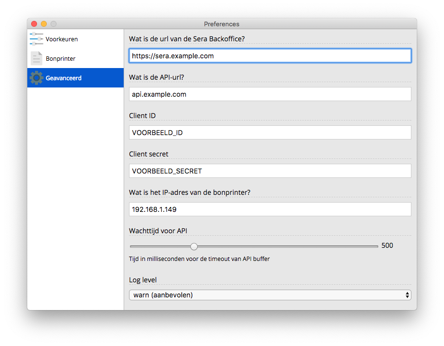

# Instellingen

## Instellingen-scherm openen

Zonder de juiste instellingen kun je nog niet werken met Sera Kassa. We moeten onder meer eerst aangeven op welke kassa we aan het werk zijn, en hoe we moeten verbinden met de Sera API.

Het instellingen-scherm is verstopt als je nog niet bent ingelogd. Om het scherm te openen druk op je je toetsenbord op \[Ctrl + komma\] \(op Windows\) of \[Cmd + komma\] \(op Mac\).


Tip: Op Mac kun je je instellingen ook openen vanuit de menubalk bovenaan je scherm. Klik op **Sera Kassa** \(naast het Apple-icoontje\) en klik vervolgens op "Preferences...".


## Voorkeuren

Allereerst moet we aangeven op welke accommodatie de kassa zich bevindt, en wat voor type kassa het betreft. De combinatie van deze gegevens bepaalt welke producten en hierna op de kassa te zien zullen zijn.

## Geavanceerde instellingen

Onder "Geavanceerd" moeten ook enkele cruciale gegevens ingevuld worden. Omdat de vulling van Sera Kassa \(zoals de productoverzichten en het klantenbeheer\) volledig afhankelijk zijn van **Sera API**, moeten we instellen hoe we Sera API kunnen benaderen.

