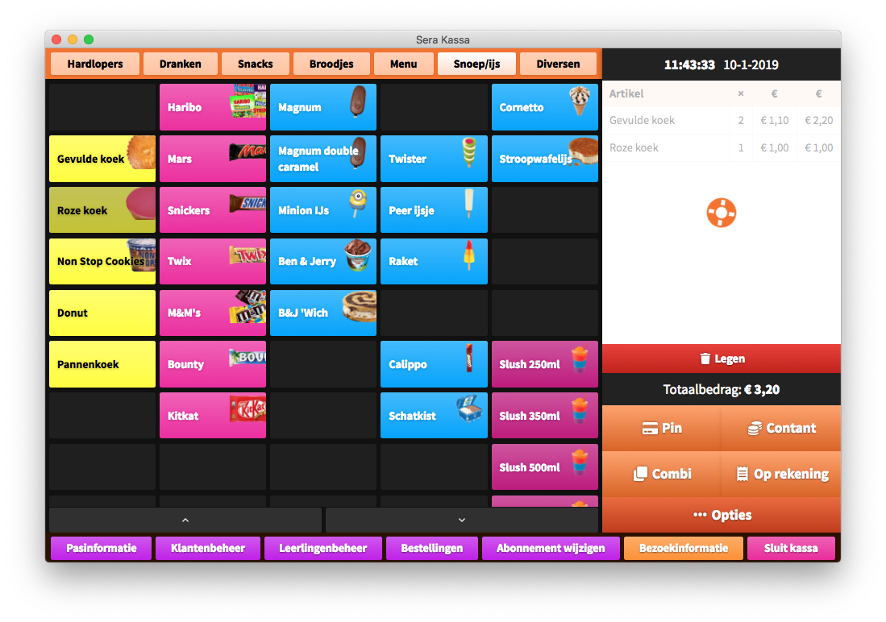
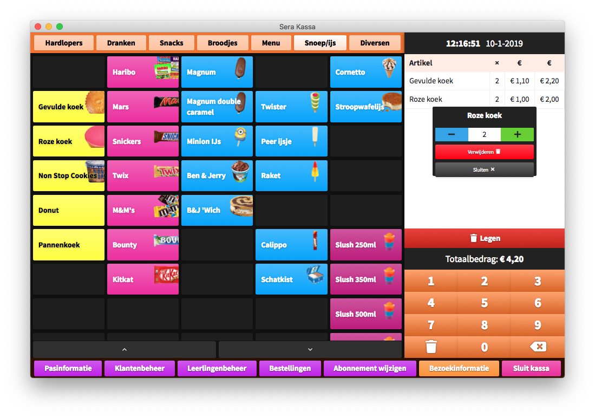
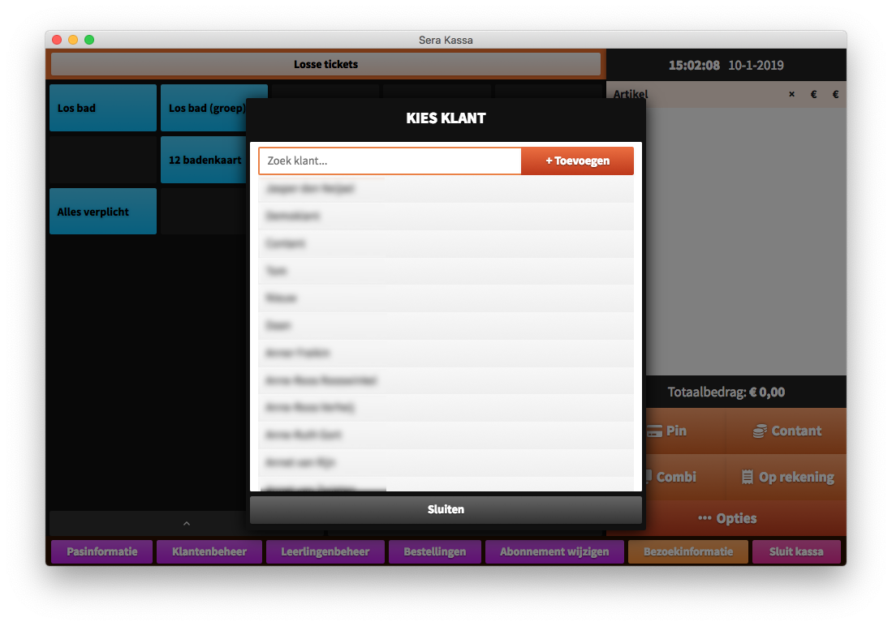

# Toevoegen aan bestelling

## Simpele producten toevoegen

Je kunt een product toevoegen aan de bestelling door er simpelweg op te klikken \(of te tikken, als de kassacomputer beschikt over een touchscreen\) in het [productoverzicht](../hoofdscherm.md#productoverzicht). Als er geen verdere [randvoorwaarden](toevoegen-aan-winkelwagen.md#producten-met-randvoorwaarden) aan het product zijn, verschijnt het product aan de rechterkant in het [bestellingsoverzicht](../hoofdscherm.md#bestelling-en-betaling). Nu is er één product toegevoegd van het type dat je aangeklikt hebt.

Als je een product aanklikt dat je al hebt toegevoegd aan de bestelling, wordt het aantal in je bestelling met 1 opgehoogd.

Kort nadat een product is verschenen in het bestellingsoverzicht, zal je kort een oranje reddingsband zien draaien over het lijstje van producten. Dit is de **laadindicator** van Sera Kassa. Als je dit ziet gebeuren, betekent het dat je huidige bestelling wordt gesynchroniseerd met de server. Dat houdt in dat Sera Kassa aan het praten is met Sera API, en je voor een korte tijd \(meestal minder dan één seconde\) niets kunt wijzigen aan je bestelling.

Als je snel achter elkaar verschillende producten toevoegt aan de bestelling, worden al deze producten verzameld en in een keer naar de server gestuurd. De wachttijd tussen klikken en het verschijnen van de laadindicator wordt dan bij iedere klik opnieuw gestart.


Pro tip: Je kunt de wachttijd \(de tijd tussen aanklikken en het verschijnen van de laadindicator\) aanpassen in de [geavanceerde instellingen](../../klaarmaken-voor-gebruik/instellingen.md#geavanceerde-instellingen). De wachttijd kan worden ingesteld tussen 0  en maximaal 2000 milliseconden. Bij een wachttijd van 0 ms wordt de wachttijd uitgeschakeld en kan er maar één handeling tegelijk worden verricht.



Het kan soms onverhoopt voorkomen dat zich een storing voordoet op de server, of in de communicatie met Sera API. Als de laadindicator langer zichtbaar is dan je verwacht, probeer dan eerst de kassa te [verversen](../complexe-producten-bestellen.md#kassa-verversen).

Blijft het probleem zich voordoen, neem dan contact op met [Sera Business Design](https://www.sera.nl/contact.html).


### Aantal handmatig aanpassen

Om het aantal producten in de bestelling handmatig op te hogen of te verlagen, kun je gebruik maken van de **bestelling-tooltip**. Die kun je openen door in de bestelling op een van de producten te klikken.

Met de ➖ en ➕ knoppen kun je het productaantal met één tegelijk verlagen of ophogen. Je kunt ook met het **toetsenbord** een aantal invoeren.

### Verwijderen uit bestelling

Om een product te verwijderen uit de bestelling, klik je op de rode knop **Verwijderen** in de bestelling-tooltip.

### De bestelling leegmaken

Het is ook mogelijk om de bestelling in een keer leeg te maken of te verwijderen. Daarvoor klik je op de rode knop **Legen** onderaan je bestelling. Dit zorgt ervoor dat je volledige bestelling wordt verwijderd.


Let op: Het leegmaken van de bestelling is niet omkeerbaar. Als de producten uit de bestelling verwijderd zijn, is het onmogelijk om deze weer terug te zetten.


## Producten met randvoorwaarden

Veel producten hebben randvoorwaarden waaraan moet worden voldaan voordat ze kunnen worden toegevoegd aan de bestelling. In het geval van een zwembad dat een 12-badenkaart verkoopt, is het mogelijk om te verplichten dat er een klant gekozen wordt. Dat is in te stellen in de [Sera Backoffice](../../sera-kassa-beheren/producten-toevoegen-of-wijzigen.md).

Als je bijvoorbeeld op het product "12-badenkaart" klikt, verschijnt er een schermpje met daarin een lijst met namen van klanten. Klik op de naam van een klant om de klant te selecteren. Het schermpje sluit dan automatisch, en als er verder geen randvoorwaarden zijn wordt het product met de juiste klant aan de bestelling toegevoegd.

Als je op de knop **Sluiten** drukt, wordt het schermpje verborgen en wordt het toevoegen van het het product aan de bestelling geannuleerd.


Als er meerdere randvoorwaarden zijn ingesteld voor een product, komen een voor een vergelijkbare schermpjes tevoorschijn. Het product wordt aan de bestelling toegevoegd als alle voor alle randvoorwaarden de bijbehorende entiteiten zijn opgegeven.


### Entiteiten toevoegen

Als de klant die je wilt selecteren nog niet in het systeem staat, kun je deze toevoegen door in het keuzeschermpje te klikken op de knop **+ Toevoegen**. Er wordt dan een programma van Sera Backoffice geopend waar je bijvoorbeeld een nieuwe klant kunt invoeren.


Sommige producten vragen naast een klant of leerling ook om bijvoorbeeld een accommodatie of tijdsperiode. Niet alle entiteiten kunnen vanuit Sera Backoffice beheerd worden, omdat ze bijvoorbeeld vaststaan of automatisch gegenereerd worden. De knop met **+ Toevoegen** zal dus niet altijd zichtbaar zijn.


Als je klaar bent met invoeren, kun je het Sera Backoffice-programma sluiten. Je kunt nu door middel van de zoekbalk in het keuzeschermpje zoeken naar de nieuw ingevoerde klant. Klik vervolgens op deze klant om die te selecteren.

## Werknemerskorting

