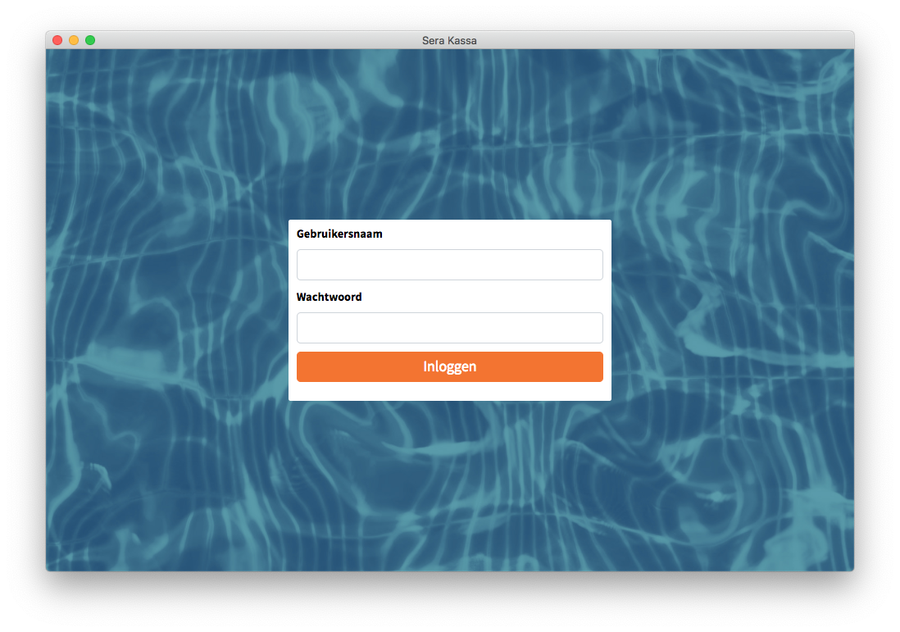

# Inloggen op Sera Kassa

Als je alles juist hebt ingesteld, kun je nu inloggen op Sera Kassa. Dat kan op twee manieren:

1. Je kunt inloggen met een combinatie van [gebruikersnaam en wachtwoord](inloggen-op-sera-kassa.md#inloggen-met-gebruikersnaam-en-wachtwoord).
2. Je kunt inloggen met een persoonlijke pas [persoonlijke pas](inloggen-op-sera-kassa.md#inloggen-met-een-persoonlijke-pas).

## Inloggen met gebruikersnaam en wachtwoord

De eerste manier waarmee je kunt inloggen op Sera Kassa, is middels een persoonlijke gebruikersnaam met wachtwoord. 

Normaal gesproken heeft iedere gebruiker van Sera Kassa een eigen gebruikersnaam. Deze gebruikersnaam is dezelfde als waarmee je kunt inloggen bij [Sera Backoffice](https://sera-business-design.gitbook.io/sera-backoffice/). De beheerder van Sera Backoffice kan nieuwe gebruikers aanmaken, die vervolgens ook op Sera Kassa kunnen inloggen.


Let op: Het is belangrijk dat nieuwe gebruikers lid zijn van de gebruikersgroep **Kassamedewerkers**, of een vergelijkbare gebruikersgroep die toegang heeft tot de programma's die nodig zijn om Sera Kassa te laten werken.


## Inloggen met een persoonlijke pas

De andere manier waarmee je kunt inloggen op Sera Kassa is door je persoonlijke pas te scannen. Om dit mogelijk te maken, moeten de volgende stappen worden genomen:

1. Er moet een [paslezer aangesloten](../klaarmaken-voor-gebruik/voorbereidingen.md) zijn op de computer waarop Sera Kassa draait.
2. Er moet een medewerker zijn aangemaakt met een gebruikersaccount met [gebruikersnaam en wachtwoord](inloggen-op-sera-kassa.md#inloggen-met-gebruikersnaam-en-wachtwoord).
3. Er moet een [pas gekoppeld](../sera-kassa-beheren/pas-koppelen.md) zijn aan de medewerker die wil inloggen op Sera Kassa.

Als deze stappen zijn voltooid, kan een medewerker zijn persoonlijke pas scannen om in te loggen. Dit werkt alleen vanaf het inlogscherm van Sera Kassa.

